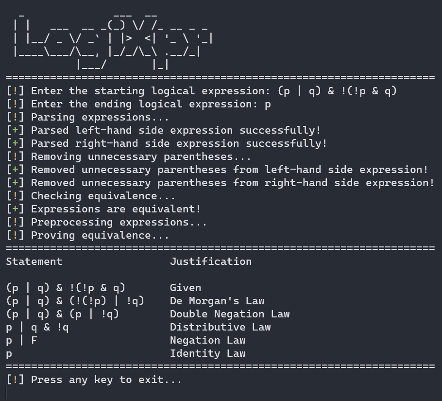
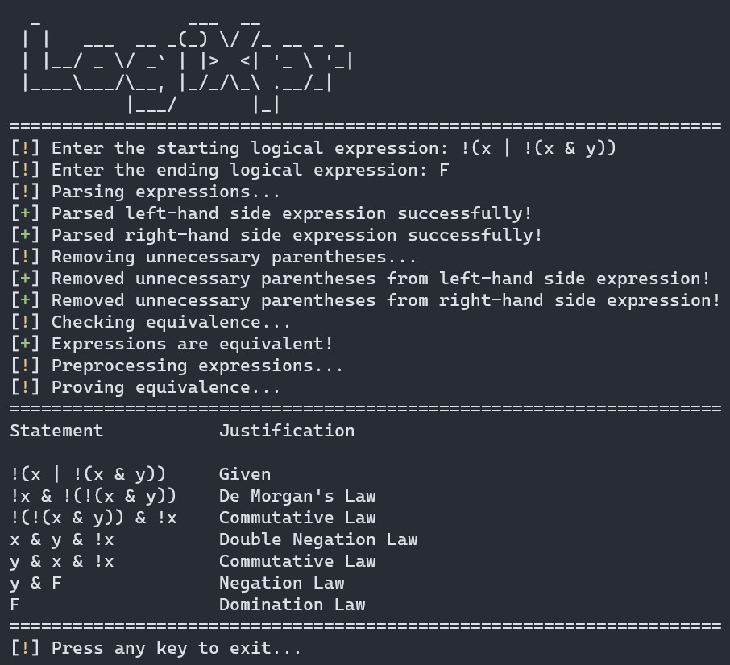

# LogiXpr

[](https://ericlin-jpg.github.io/LogiXpr/)


LogiXpr is a C++ console application that evaluates boolean expressions. It supports the following operators:
- `!` - not
- `&` - and
- `|` - or
- `^` - xor
- `->` - implies
- `<=>` - if and only if

It also supports the following constants:
- `T` - true
- `F` - false

And variables from `a` to `z`.

## How it works
LogiXpr utilizes the shunting yard algorithm to convert expressions into abstract syntax trees (ASTs). These ASTs are subsequently evaluated to determine their equivalence using a truth table analysis. If an equivalence is detected, LogiXpr proceeds to recursively evaluate the initial AST by testing each node against the possible equivalences defined in the `include\equivLaws.h` file.

To find the shortest equivalent expression, LogiXpr employs a breadth-first search algorithm. This search algorithm systematically explores various transformations and evaluates the resulting expressions at each level. By leveraging the breadth-first search approach, LogiXpr efficiently identifies the shortest equivalent expression by considering all possible transformations at each step before delving deeper into the search space.

## Preview
<p align="center" width="100%">
  
  
</p>

## Installation
To build and install LogiXpr, you will need to have CMake installed on your system. You can download CMake from the official website: https://cmake.org/download/.

1. Clone the repository
```bash
git clone https://github.com/ericlin-jpg/LogiXpr.git
```

2. Create a build directory
```bash
cd LogiXpr
mkdir build
cd build
```

3. Run CMake
```bash
cmake ..
```

4. Build the project
```bash
cmake --build . --config Release
```

5. Go to the `bin\Release` directory and run the executable
```bash
cd bin\Release
./LogiXpr
```

## Running Unit Tests
To run the unit tests in `tests`, run `build.sh`.
